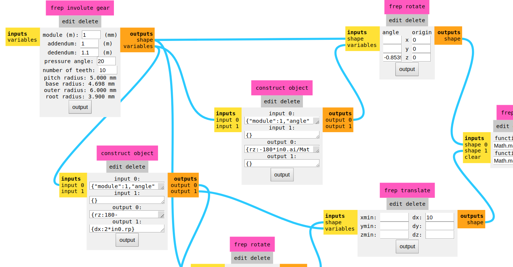

# CBA `mods` fork (by TBL)

Everything is better at the beach :sunglasses:

My fork is focused in UI. See also [Sibu's](https://github.com/sibusaman/mods) fork, focused in machine functionality. We keep cherry-picking each other.

## To run `mods` online

Just go to https://thebeachlab.github.io/mods

## To install and run `mods` locally in Linux

You need to first install [node.js](https://docs.npmjs.com/getting-started/installing-node).

Install the [http-server](https://www.npmjs.com/package/http-server) npm package. Including '-g' sets the installs the package globally, allowing you to use it as a command line tool:

`npm install http-server -g`

Clone the mods repository:

`git clone https://github.com/TheBeachLab/mods.git`

Use the command line to navigate to the root of the mods repository:

`cd mods`

Start up a server:

`http-server` or `hs`

Open a browser tab and go to `127.0.0.1:8080` which is the same as `http://localhost:8080` to view the server that you just started.

Depending on how to need to use mods you can start local servers located in `mods/js`, for example, if you start from the root of the mods repository:

`cd js`

`node printserver.js ::ffff:localhost 1234` where `1234` is the port you would like to use.

## To install and run `mods` locally in Windows

Kindly email support@microsoft.com

## `mods` machine connection debugging

### Serial Server

`serialserver.js` is used by the Roland MDX-20.

set correct serial port permission (do this each time you reboot the machine): `chmod a+rwx /dev/ttyUSB0`

Another option is add your user to the `dialout` group (in Ubuntu) or the `uucp` group (in Arch et al.)

### Device Server

Roland GX-24 and Roland GS-24 vinyl cutters, and the Roland SRM-20 are identified as a printer. When you plug them a file is created `/dev/usb/lpx` where `x` is a number `/dev/usb/lp0`, `/dev/usb/lp1` 

start serialserver in the terminal so you can see the logs as it tries to connect.  navigate to the mods/js folder in the terminal (probably use `cd ~/mods/js`) and type: `node serialserver.js ::ffff:127.0.0.1 1234`

check serialserver is running with: `ps aux | grep node`

## Common Issues

1. **_Help! My SRM-20 will only run a single job and then go dead!_** Chances are you are using printserver.js instead of deviceserver.js to connect to the machine.  For now, we need to treat the SRM-20 as a device instead of a printer.
2. **_Argg... why do I need to reset permissions on /dev/usb/lp0 every restart?_**  You can use `sudo add_user username lp` and `sudo add_user username lpadmin` to make persistent permissions.
3. **_Why is my web socket connection refused when the addresses are the same?_** This can happen due to a difference between IPV4 and IPV6 addresses.  In your start mods server script, try changing 127.0.0.1 to ::ffff:127.0.0.1 and see if it helps.
